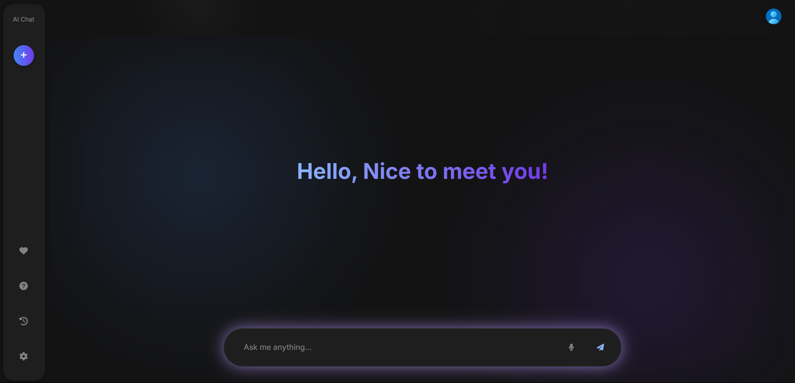

# 🤖 AI-Talk: Your Personal AI Chat Companion
Welcome to **AI-Talk**, an interactive web application that brings conversational AI to your fingertips Engage in real-time dialogues with an AI assistant, exploring a wide range of topics and receiving instant responses.

## 🌟 Features

- **Real-Time Conversations** Chat seamlessly with an AI that understands and responds to your questions.
- **User-Friendly Interface** Enjoy a clean and intuitive design that makes interaction effortless.
- **Customizable API Integration** Easily integrate your own API to enhance and personalize your experience.

## 🚀 Getting Started

1. **Clone the Repository*: Download or clone the AI-Talk repository to your local machine.
2. **Install Dependencies*: Navigate to the project directory and install the necessary packages.
3. **Integrate Your API*: Replace the placeholder API endpoint with your own to enable personalized interactions.
4. **Run the Application*: Start the development server and begin your AI chat experience!

## 🔧 API Integratin

To connect AI-Talk with your own I:

- **Locate the API Configuration*: Find the `script.js` file in the directory.
- **Update the Endpoint*: Replace the existing API URL with your own endpoint.
- **Set Up Authentication*: If your API requires authentication, ensure you include the necessary headers or talks.

By integrating your API, you can tailor AI-Talk to suit your specific needs and preferences.

## 📸 Preview

## 🤝 Contribuing

We welcome contributions from the commnity! To contrbute:

1. **Fork the Repositoy**: Create a personal copy of the prect.
2. **Create a New Branh**: Use descriptive names for your brahes.
3. **Make Your Changs**: Implement your feature ofix.
4. **Submit a Pull Requet**: Describe your changes and submit for riew.
